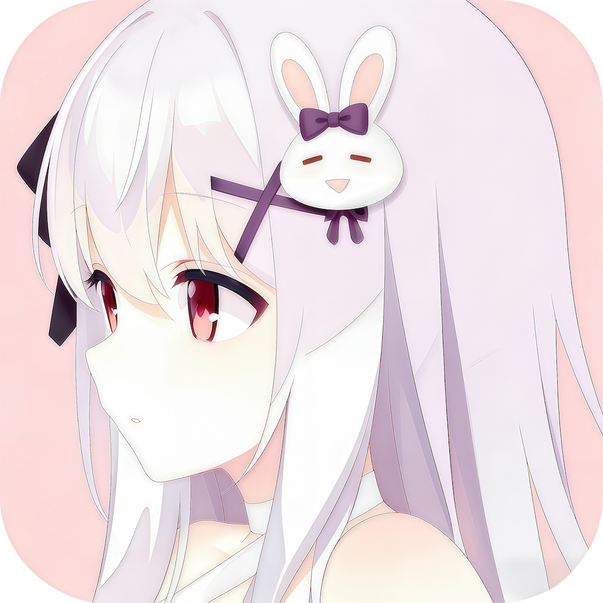

[简体中文](README.md) | English

<div align="center">
  
</div>
<div align="center">
<a href="https://trendshift.io/repositories/9120" target="_blank"></a>
</div>

## Project Introduction


[](https://hub.docker.com/r/eritpchy/video-subtitle-remover)

Video-subtitle-remover (VSR) is an AI-based software that removes hardcoded subtitles from videos.
It mainly implements the following functionalities:
- **Lossless resolution**: Removes hardcoded subtitles from videos and generates files without subtitles
- Fills in the removed subtitle text area using a powerful AI algorithm model (non-adjacent pixel filling and mosaic removal)
- Supports custom subtitle positions by only removing subtitles in the defined location (input position)
- Supports automatic removal of all text throughout the entire video (without inputting a position)
- Supports multi-selection of images for batch removal of watermark text


**Instructions:**

- If you have questions, please join the discussion group: QQ Group 210150985 (full), 806152575 (full), 816881808 (full), 295894827
- Download the compressed package, extract and run it directly. If it cannot run, follow the tutorial below to try installing from source

**Download:** <a href="https://github.com/YaoFANGUK/video-subtitle-remover/releases">Release</a>

**Pre-built Package Comparison**:

| Pre-built Package Name            | Python | Paddle | Torch | Environment                    | Supported Compute Capability Range |
|-----------------------------------|--------|--------|-------|--------------------------------|------------------------------------|
| `vsr-windows-cpu.7z`              | 3.12   | 3.0.0  | 2.7.0 | Universal                      | Universal                          |
| `vsr-windows-directml.7z`         | 3.12   | 3.0.0  | 2.4.1 | Windows non-Nvidia GPU         | Universal                          |
| `vsr-windows-nvidia-cuda-11.8.7z` | 3.12   | 3.0.0  | 2.7.0 | CUDA 11.8                      | 3.5 – 8.9                         |
| `vsr-windows-nvidia-cuda-12.6.7z` | 3.12   | 3.0.0  | 2.7.0 | CUDA 12.6                      | 5.0 – 8.9                         |
| `vsr-windows-nvidia-cuda-12.8.7z` | 3.12   | 3.0.0  | 2.7.0 | CUDA 12.8                      | 5.0 – 9.0+                        |

> NVIDIA provides a list of compute capabilities for each GPU model. Refer to [CUDA GPUs](https://developer.nvidia.com/cuda-gpus) to check which CUDA version is compatible with your GPU.

**Docker Versions:**
```shell
  # Nvidia 10, 20, 30 Series Graphics Cards
  docker run -it --name vsr --gpus all eritpchy/video-subtitle-remover:1.4.0-cuda11.8 python backend/main.py -i test/test.mp4 -o test/test_no_sub.mp4

  # Nvidia 40 Series Graphics Cards
  docker run -it --name vsr --gpus all eritpchy/video-subtitle-remover:1.4.0-cuda12.6 python backend/main.py -i test/test.mp4 -o test/test_no_sub.mp4

  # Nvidia 50 Series Graphics Cards
  docker run -it --name vsr --gpus all eritpchy/video-subtitle-remover:1.4.0-cuda12.8 python backend/main.py -i test/test.mp4 -o test/test_no_sub.mp4

  # AMD / Intel Dedicated or Integrated Graphics
  docker run -it --name vsr --gpus all eritpchy/video-subtitle-remover:1.4.0-directml python backend/main.py -i test/test.mp4 -o test/test_no_sub.mp4

  # CPU
  docker run -it --name vsr --gpus all eritpchy/video-subtitle-remover:1.4.0-cpu python backend/main.py -i test/test.mp4 -o test/test_no_sub.mp4

  # Export video
  docker cp vsr:/vsr/test/test_no_sub.mp4 ./
```

**Command Line:**
```
Video Subtitle Remover Command Line Tool

options:
  -h, --help            show this help message and exit
  --input INPUT, -i INPUT
                        Input video file path
  --output OUTPUT, -o OUTPUT
                        Output video file path (optional)
  --subtitle-area-coords YMIN YMAX XMIN XMAX, -c YMIN YMAX XMIN XMAX
                        Subtitle area coordinates (ymin ymax xmin xmax). Can be specified multiple times for multiple areas.
  --inpaint-mode {sttn-auto,sttn-det,lama,propainter,opencv}
                        Inpaint mode, default is sttn-auto
```
## Demonstration

- GUI:

<p style="text-align:center;"></p>

<p style="text-align:center;"><a href="https://b23.tv/guEbl9C"></a></p>

## Source Code Usage Instructions


#### 1. Install Python

Please ensure that you have installed Python 3.12+.

- Windows users can go to the [Python official website](https://www.python.org/downloads/windows/) to download and install Python.
- MacOS users can install using Homebrew:
  ```shell
  brew install python@3.12
  ```
- Linux users can install via the package manager, such as on Ubuntu/Debian:
  ```shell
  sudo apt update && sudo apt install python3.12 python3.12-venv python3.12-dev
  ```

#### 2. Install Dependencies

It is recommended to use a virtual environment to manage project dependencies to avoid conflicts with the system environment.

(1) Create and activate the virtual environment:
```shell
python -m venv videoEnv
```

- Windows:
```shell
videoEnv\\Scripts\\activate
```
- MacOS/Linux:
```shell
source videoEnv/bin/activate
```

#### 3. Create and Activate Project Directory

Change to the directory where your source code is located:
```shell
cd <source_code_directory>
```
> For example, if your source code is in the `tools` folder on the D drive and the folder name is `video-subtitle-remover`, use:
> ```shell
> cd D:/tools/video-subtitle-remover-main
> ```

#### 4. Install the Appropriate Runtime Environment

This project supports four running modes: CUDA (NVIDIA GPU acceleration), CPU (no GPU), DirectML (AMD, Intel and other GPU/APU acceleration), and macOS (Apple Silicon).

##### (1) CUDA (For NVIDIA GPU users)

> Make sure your NVIDIA GPU driver supports the selected CUDA version.

- Recommended CUDA 11.8, corresponding to cuDNN 8.6.0.

- Install CUDA:
  - Windows: [Download CUDA 11.8](https://developer.download.nvidia.com/compute/cuda/11.8.0/local_installers/cuda_11.8.0_522.06_windows.exe)
  - Linux:
    ```shell
    wget https://developer.download.nvidia.com/compute/cuda/11.8.0/local_installers/cuda_11.8.0_520.61.05_linux.run
    sudo sh cuda_11.8.0_520.61.05_linux.run
    ```
  - CUDA is not supported on MacOS.

- Install cuDNN (CUDA 11.8 corresponds to cuDNN 8.6.0):
  - [Windows cuDNN 8.6.0 Download](https://developer.download.nvidia.cn/compute/redist/cudnn/v8.6.0/local_installers/11.8/cudnn-windows-x86_64-8.6.0.163_cuda11-archive.zip)
  - [Linux cuDNN 8.6.0 Download](https://developer.download.nvidia.cn/compute/redist/cudnn/v8.6.0/local_installers/11.8/cudnn-linux-x86_64-8.6.0.163_cuda11-archive.tar.xz)
  - Follow the installation guide in the NVIDIA official documentation.

- Install PaddlePaddle GPU version (CUDA 11.8):
  ```shell
  pip install paddlepaddle-gpu==3.0.0 -i https://www.paddlepaddle.org.cn/packages/stable/cu118/
  ```
- Install Torch GPU version (CUDA 11.8):
  ```shell
  pip install torch==2.7.0 torchvision==0.22.0 --index-url https://download.pytorch.org/whl/cu118
  ```

- Install other dependencies:
  ```shell
  pip install -r requirements.txt
  ```

- For Linux systems, you also need to install:

  ```shell
  # for cuda 12.x
  pip install onnxruntime-gpu==1.22.0
  # for cuda 11.x
  pip install onnxruntime-gpu==1.20.1 --index-url https://aiinfra.pkgs.visualstudio.com/PublicPackages/_packaging/onnxruntime-cuda-11/pypi/simple/
  ```
  > For more details, see: [Install ONNX Runtime](https://onnxruntime.ai/docs/install/#install-onnx-runtime-gpu-cuda-12x)

##### (2) DirectML (For AMD, Intel, and other GPU/APU users)

- Suitable for Windows devices with AMD/NVIDIA/Intel GPUs.
- Install ONNX Runtime DirectML version:
  ```shell
  pip install paddlepaddle==3.0.0 -i https://www.paddlepaddle.org.cn/packages/stable/cpu/
  pip install -r requirements.txt
  pip install torch_directml==0.2.5.dev240914
  ```
##### (3) CPU Only (For systems without GPU or those not wanting to use GPU acceleration)

- Suitable for systems without GPU or those that do not wish to use GPU.
  ```shell
  pip install paddlepaddle==3.0.0 -i https://www.paddlepaddle.org.cn/packages/stable/cpu/
  pip install torch==2.7.0 torchvision==0.22.0
  pip install -r requirements.txt
  ```
##### (4) Running on macOS (Apple Silicon)
- Suitable for macOS (Apple Silicon) devices
- For macOS (Intel), please use the CPU mode. Forcing GPU usage will only be slower.
- On macOS (Apple Silicon), the accuracy of the PP-OCRv4-Server model for subtitle detection seems suboptimal. We recommend using an alternative model.
  ```shell
  pip install paddlepaddle==3.0.0 -i https://www.paddlepaddle.org.cn/packages/stable/cpu/
  pip install torch==2.7.0 torchvision==0.22.0
  pip install -r requirements.txt
  ```
  > Tested with Python 3.13
#### 4. Run the program

- Run the graphical interface

```shell
python gui.py
```

- Run the command line version (CLI)

```shell
python ./backend/main.py
```

## Common Issues
1. How to deal with slow removal speed

You can greatly increase the removal speed by modifying the parameters in backend/config.py:
```python
MODE = InpaintMode.STTN  # Set to STTN algorithm
STTN_SKIP_DETECTION = True # Skip subtitle detection, skipping may cause missed subtitles or damage to frames without subtitles
```

2. What to do if the video removal results are not satisfactory

Modify the values in backend/config.py and try different removal algorithms. Here is an introduction to the algorithms:

> - InpaintMode.STTN algorithm: Good for live-action videos and fast in speed, capable of skipping subtitle detection
> - InpaintMode.LAMA algorithm: Best for images and effective for animated videos, moderate speed, unable to skip subtitle detection
> - InpaintMode.PROPAINTER algorithm: Consumes a significant amount of VRAM, slower in speed, works better for videos with very intense movement

- Using the STTN algorithm

```python
MODE = InpaintMode.STTN  # Set to STTN algorithm
# Number of neighboring frames, increasing this will increase memory usage and improve the result
STTN_NEIGHBOR_STRIDE = 10
# Length of reference frames, increasing this will increase memory usage and improve the result
STTN_REFERENCE_LENGTH = 10
# Set the maximum number of frames processed simultaneously by the STTN algorithm, a larger value leads to slower processing but better results
# Ensure that STTN_MAX_LOAD_NUM is greater than STTN_NEIGHBOR_STRIDE and STTN_REFERENCE_LENGTH
STTN_MAX_LOAD_NUM = 30
```
- Using the LAMA algorithm
```python
MODE = InpaintMode.LAMA  # Set to LAMA algorithm
LAMA_SUPER_FAST = False  # Ensure quality
```

> If you are not satisfied with the subtitle removal results, you can check the training methods in the design folder, use the code in backend/tools/train to train, and then replace the old model with the trained model.

3. 7z file extraction error

Solution: Upgrade the 7-zip extraction program to the latest version.


## Sponsor


